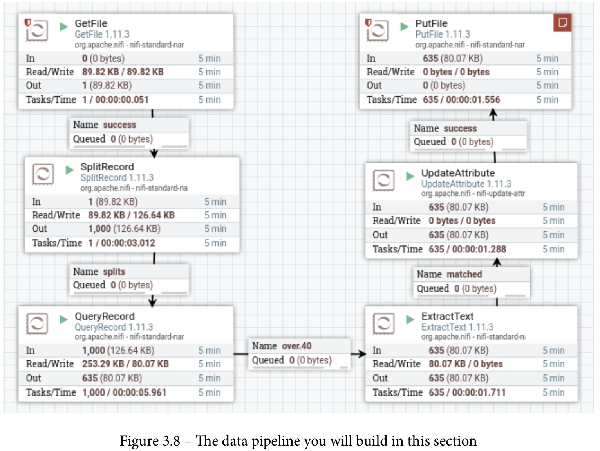
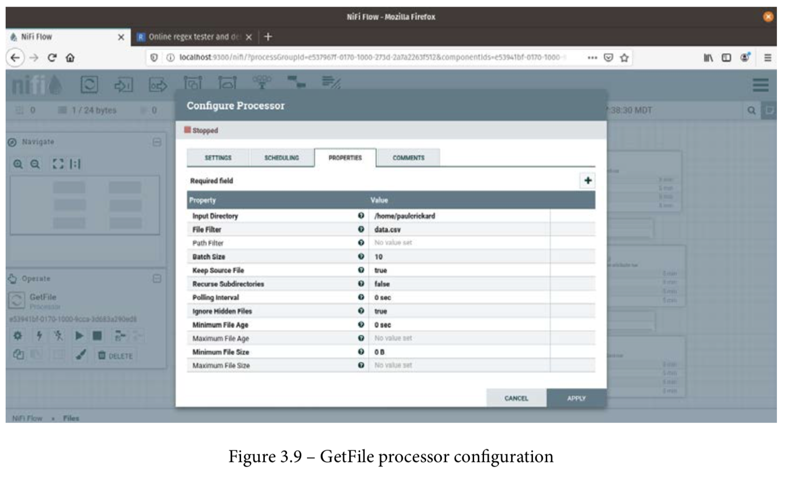

## Working with CSV in NiFi

Working with files in NiFi requires many more steps than you had to use when doing the same tasks in Python. There are benefits to using more steps and using Nifi, including that someone who does not know code can look at your data pipeline and understand what it is you are doing. You may even find it easier to remember what it is you were trying to do when you come back to your pipeline in the future. Also, changes to the data pipeline do not require refactoring a lot of code; rather, you can reorder processors via drag and drop.

In this section, you will create a data pipeline that reads in the data.CSV file you created in Python. It will run a query for people over the age of 40, then write out that record to
a file.

The result of this section is shown in the following screenshot:

### Reading a file with GetFile
The first step in your data pipeline is to read in the data.csv file. To do that, take the following steps:

    1. Drag the Processor icon from the NiFi toolbar to the canvas. Search for GetFile and then select it.
    
    2. To configure the GetFile processor, you must specify the input directory. In the Python examples earlier in this chapter, I wrote the data.CSV file to my home directory, which is home/paulcrickard, so this is what I will use for the input directory.
    
    3. Next, you will need to specify a file filter. This field allows the NiFi expression language, so you could use regular expressions (regex) and specify any file ending with CSV – [^\.].*\.CSV – but for this example, you can just set the value to data.csv.
    
    4. Lastly, the Keep Source File property should be set to true. If you leave it as false, NiFi will delete the file once it has processed it. The complete configuration is shown in the following screenshot:

